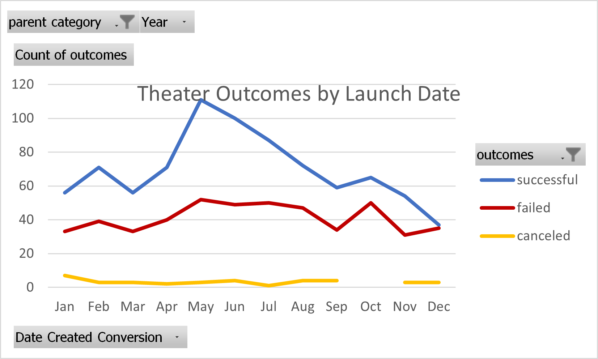

# kickstarter-analysis
Performing kickstarter-analysis for Louise's project to find hiden trends 

#Category Outcomes

Based on this the chart, it shows that "Theater" is the most funded Category and with the most successful rate but with that also the most failed rate. Journalism was the least funded caterory and it all 24 failed

#Outcomes based on Dates

This chart shows that for the Catergory "Theater", May launched over 100 kickstarters with the most successful rate

#Outcomes based on Goals

this chat shows that has successful percent rate starts to deline as the pleaged amount started to get higher.
